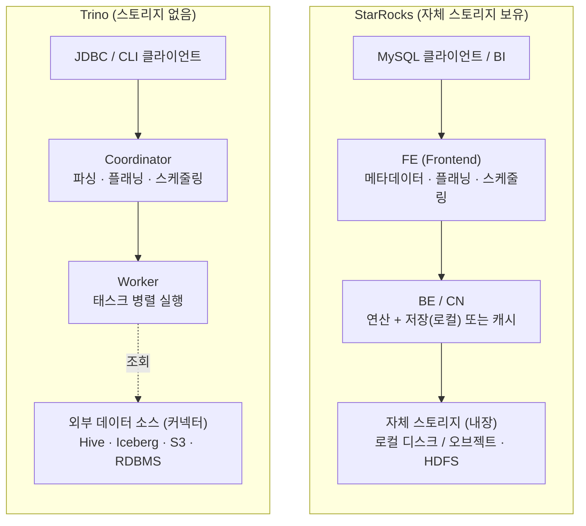

# StarRocks vs Trino — 아키텍처 비교 및 운영성 평가

> 작성일: 2026-09-11 · 기준: 오픈소스(커뮤니티) 에디션, 공식 문서 근거

---

## 1. 개요

| 구분 | StarRocks | Trino |
|---|---|---|
| 근본 성격 | 자체 스토리지를 가진 **OLAP 데이터 웨어하우스** | 스토리지가 없는 **연합 쿼리(federation) 엔진** |
| 실행 모델 | MPP · 완전 벡터화 실행 엔진 | MPP · 파이프라인 스트리밍 실행 |
| 저장 | 자체 컬럼형 저장 엔진(실시간 업데이트) + 레이크 조회 | 없음 (항상 외부 소스 조회) |
| 메타데이터 | FE가 내부 관리 (BDB JE + Raft 복제) | 클러스터 상태는 코디네이터, 레이크 메타데이터는 외부 Metastore |
| 접속 | MySQL 프로토콜 호환 | 자체 프로토콜 / JDBC |
| 확장 방식 | 통합 엔진, 커넥터 개념 없음 | 플러그인형 **커넥터**로 소스 확장 |

한 줄 요약: **Trino**는 여러 이기종 소스를 하나의 SQL로 조회하는 순수 연합 쿼리 엔진이고,
**StarRocks**는 자체 컬럼형 스토리지와 실시간 적재를 갖춘 고성능 OLAP 웨어하우스이면서 데이터 레이크도 조회할 수 있는 시스템이다.

---

## 2. 아키텍처 구성도

두 시스템은 "계획 담당 노드 1종 + 실행 담당 노드 1종" 구조를 공유한다.
가장 큰 차이는 **스토리지 소유 여부**다.

**층별 대응 관계**

- `FE` ≈ `Coordinator` — 파싱·플래닝·스케줄링. 단, FE는 메타데이터까지 내부(BDB JE + Raft)로 복제 관리하는 반면, Trino 코디네이터는 레이크 메타데이터를 외부 Metastore에 의존한다.
- `BE / CN` ≈ `Worker` — 실제 연산을 병렬 실행하는 워커.
- 스토리지 층: StarRocks는 데이터를 **소유·관리**(실선), Trino는 **소유하지 않고 조회만**(점선).

---

## 3. StarRocks 컴포넌트별 역할

### FE (Frontend) — 시스템의 두뇌
메타데이터 관리, 클라이언트 연결 관리, 쿼리 플래닝, 쿼리 스케줄링을 담당한다.
각 FE는 BDB JE(Berkeley DB Java Edition)로 메모리에 메타데이터 완전 복사본을 유지한다.

| 역할 | 메타데이터 | 리더 선출 |
|---|---|---|
| **Leader** | 읽기·쓰기 모두 가능(유일). 변경 후 Raft로 동기화, 과반 팔로워 동기화 시 쓰기 성공 | 팔로워 중에서 선출 |
| **Follower** | 읽기만 가능. 리더 로그를 동기화·재생 | 선출에 참여(과반 활성 필요) |
| **Observer** | 로그 동기화·재생 | 선출 미참여, 쿼리 동시성 확장용 |

### BE (Backend) — shared-nothing의 저장 + 실행
데이터 저장과 SQL 실행을 담당한다. FE가 규칙에 따라 데이터를 분배하면 BE가 포맷 변환·기록·인덱스 생성을 수행하고, 대상 데이터를 보유한 BE가 쿼리를 실행해 데이터 전송·복사를 없앤다.

### CN (Compute Node) — shared-data의 순수 연산
데이터 저장을 제외한 BE의 모든 기능을 수행하는 무상태 노드. 메모리 → 로컬 디스크 → 원격 스토리지의 다계층 캐시를 사용하며, 스토리지와 분리되어 데이터 이동 없이 스케일링된다.

**배포 모델**
- **Shared-nothing**: BE가 저장+연산. 로컬 데이터 직접 접근으로 초저지연. 최고 성능 지향.
- **Shared-data**: CN이 연산+캐시, 데이터는 S3/GCS/Azure/MinIO/HDFS. 캐시 적중 시 shared-nothing급 성능, 초 단위 탄력 확장, 저비용.

---

## 4. 공통점과 차이점

**공통점**
- 분산 MPP: 조정 노드와 병렬 실행 워커가 분리
- 비용 기반 옵티마이저(CBO) 사용
- Iceberg · Hive · Delta Lake 등 데이터 레이크 직접 조회
- 무중단 수평 확장, 표준 SQL 지원

**차이점**
- StarRocks는 자체 컬럼형 스토리지·실시간 적재(Stream Load, Routine Load)를 갖춘 웨어하우스, Trino는 적재 없이 외부 소스를 조회하는 연합 엔진
- 메타데이터: StarRocks 내부 관리(Raft 복제) vs Trino 외부 Metastore 의존
- 접속: MySQL 프로토콜 vs 자체 JDBC
- 강점: StarRocks는 자체 스토리지 기반 저지연·고동시성 OLAP 서빙, Trino는 이기종 소스 연합 쿼리

---

## 5. 운영성 평가 (20점)

채점 기준(판정 방법)에 따른 항목별 평가. 점수는 공식 문서 근거 + 판단이며 소수점은 상대 비교용이다.

### 5.1 설치·초기 구성 (4점) — 소요 시간·수동 단계 수
- **StarRocks**: 외부 컴포넌트 의존 없음. Docker(수 분), 수동, K8s Operator, Helm 지원. 프로덕션 수동 배포는 사전 점검 → 규모 계획 → 환경 설정 → FE → BE/CN → 클러스터 구성 단계가 있고, shared-data는 오브젝트 스토리지 준비 필요. → **3.5**
- **Trino**: 코디네이터+워커 구성. config/node/jvm + 카탈로그 파일만으로 경량 기동, 기본 카탈로그(tpch 등) 포함되어 설치 직후 쿼리 가능. 실사용엔 소스별 카탈로그·외부 메타스토어 필요. → **3.5**

### 5.2 스케일 아웃/인 (4점) — 무중단 여부·재분배 완료 시간
- **StarRocks**: 무중단 수평 확장. BE 증설 시 태블릿 자동 재분산, 축소는 DECOMMISSION으로 데이터 선(先)이전 후 제거(적재·쿼리 무영향). shared-nothing은 재분배 시간 소요, shared-data의 CN은 재분배 없이 초 단위 조정. → **3.5**
- **Trino**: 무상태 워커, 자체 저장 없음 → 재분배 자체가 없음. 워커 graceful shutdown API로 무손실 종료, KEDA 오토스케일(0~N). 스케일링은 Trino의 강점. → **4.0**

### 5.3 롤링 업그레이드 (2점) — 무중단 여부
- **StarRocks**: 롤링 업그레이드 공식 지원(BE·CN 먼저 → FE 팔로워 → 리더). Graceful Exit로 한 노드씩 드레인하며 무중단 재시작·업그레이드. → **2.0**
- **Trino**: 전 노드 동일 버전 요구 → 단일 클러스터 무중단 롤링 재시작 불가, 통상 블루-그린. 코디네이터는 graceful shutdown 미지원(재시작 시 실행 중 쿼리 실패). → **1.0**

### 5.4 백업·복구 (6점) — 백업 대상 완전성·복구 성공·RTO/RPO
- **StarRocks**: 스냅샷 기반 BACKUP/RESTORE, v3.4.0부터 테이블·MV·논리뷰·UDF·외부 카탈로그 메타데이터로 대상 확장. 그러나 네이티브는 **full 백업만**, **shared-data 미지원**, DB당 동시 1작업, 압축 불가, 스냅샷 이후 적재분 미포함(RPO 거침), PITR 없음(DROP은 기본 1일 내 RECOVER). → **3.5**
- **Trino**: 자체 스토리지가 없어 데이터 백업 기능 없음(소스가 책임). 무상태라 엔진 복구는 빠름(RTO 양호)이나 루브릭이 요구하는 백업 대상 완전성·RPO를 시스템이 제공하지 않음. **기준 성격 불일치** — Iceberg 등 소스 계층 타임트래블로 실효 커버 가능. → **2.0**

### 5.5 모니터링·멀티테넌시 (4점) — 기본 지표·쿼리 프로파일·리소스 그룹
- **StarRocks**: Prometheus 호환 지표 + Grafana 템플릿. 프로파일: EXPLAIN / EXPLAIN ANALYZE / SHOW PROFILELIST / ANALYZE PROFILE + 런타임 프로파일. 리소스 그룹: 메모리 하드 리밋, v3.3.5부터 CPU 하드 리밋(exclusive_cpu_cores), 사용자·롤·DB·쿼리타입·소스IP 분류. → **3.75**
- **Trino**: JMX 지표(+SQL 조회), 웹 UI 쿼리 통계, EXPLAIN ANALYZE. 리소스 그룹: JSON 기반 소프트 메모리·하드 동시성·큐·가중 스케줄링, 셀렉터. 다만 동시성·큐잉·admission control 성격이 강함. → **3.5**

### 5.6 종합 채점

| 세부 (배점) | StarRocks | Trino |
|---|---:|---:|
| 설치·초기 구성 (4) | 3.5 | 3.5 |
| 스케일 아웃/인 (4) | 3.5 | 4.0 |
| 롤링 업그레이드 (2) | 2.0 | 1.0 |
| 백업·복구 (6) | 3.5 | 2.0 |
| 모니터링·멀티테넌시 (4) | 3.75 | 3.5 |
| **합계 (20)** | **16.25** | **14.0** |

---

## 6. 결론 및 유의사항

- 운영성 기준에서 **StarRocks ≈ 16.25점, Trino ≈ 14.0점**.
- **Trino**는 무상태 아키텍처로 스케일링이 최고 수준이나, 단일 클러스터 롤링 업그레이드 불가(블루-그린 필요)·자체 백업 부재로 감점.
- **StarRocks**는 롤링 업그레이드·자체 백업·CPU 하드 격리로 고르게 우수하나, 백업이 full-only이고 shared-data 미지원이 약점.

**유의사항 1 — 백업·복구 항목의 성격 불일치**: 이 항목은 스토리지를 소유하는 DW에 유리하게 설계되어, Trino의 낮은 점수는 실제 운영 결함이 아니라 기준 정합성 문제에 가깝다. Trino를 Iceberg 레이크하우스로 운용하면 소스 계층 스냅샷·타임트래블이 이 역할을 대신하므로, 기준을 "연결 소스 포함 실효 백업"으로 바꾸면 점수가 달라진다.

**유의사항 2 — 소수점 배점**: 세부 배점의 소수점은 상대 비교용 판단값이다. 실측(재분배 시간, 실제 RTO/RPO 측정)을 판정 방법에 넣을 경우 그 결과에 맞춰 조정 권장.

---

## 부록 — 참고 문서 (공식)

**StarRocks**
- Architecture: https://docs.starrocks.io/docs/introduction/Architecture/
- Scale in/out: https://docs.starrocks.io/docs/administration/management/Scale_up_down/
- Upgrade: https://docs.starrocks.io/docs/deployment/upgrade/
- Graceful Exit: https://docs.starrocks.io/docs/administration/management/graceful_exit/
- Backup & Restore: https://docs.starrocks.io/docs/administration/management/Backup_and_restore/
- Monitor & Alert: https://docs.starrocks.io/docs/administration/management/monitoring/Monitor_and_Alert/
- Query Profile: https://docs.starrocks.io/docs/administration/query_profile_text_based_analysis/
- Resource Isolation FAQ: https://docs.starrocks.io/docs/faq/resource_isolation_faq

**Trino**
- Deployment: https://trino.io/docs/current/installation/deployment.html
- Query resiliency (FTE): https://trino.io/docs/current/installation/query-resiliency
- Graceful shutdown: https://trino.io/docs/current/admin/graceful-shutdown.html
- Resource groups: https://trino.io/docs/current/admin/resource-groups.html
- Monitoring with JMX: https://trino.io/docs/current/admin/jmx.html
- Rolling upgrade 논의: https://github.com/trinodb/trino/discussions/17515
